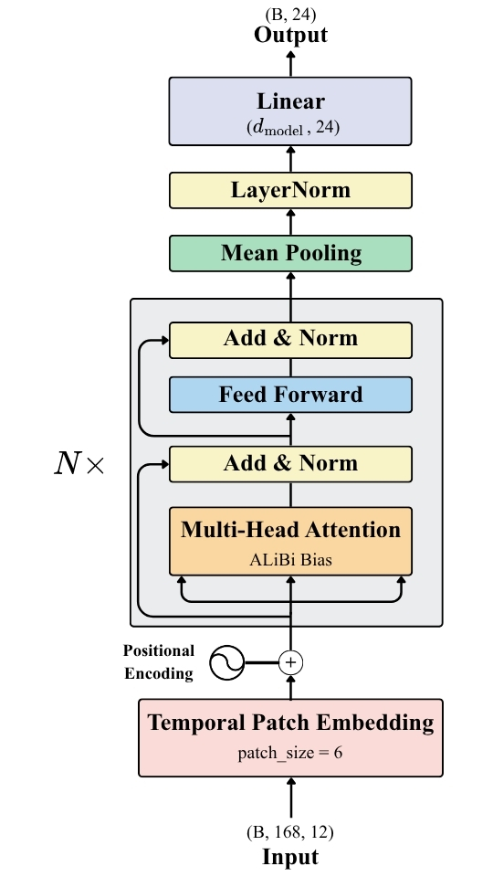

# WxFormer — Previsão Meteorológica com Transformer

O WxFormer consiste em um modelo de *encoder* Transformer para previsão pontual de temperatura do ar a 2 m de elevação em relação ao solo para a localidade de Campinas, SP, $(\text{lat}: -47.1°, \text{ long}: -22.9°)$
com horizonte de 24 horas a partir de uma janela de contexto de 168 horas de reanálise obtidas pelo dataset ERA5-Land (ECMWF).

> **📌 Observação:** A documentação técnica completa, incluindo metodologia detalhada, resultados e discussão se encontra em [**WxFormer**](./WxFormer.pdf).


## Objetivo

O WxFormer investiga como o volume de dados históricos afeta a qualidade preditiva de um Transformer meteorológico. Quatro experimentos foram conduzidos com janelas
de treinamento de **5, 10, 50 e 75 anos** de reanálise do dataset ERA5-Land. Em cada um, **100** arquiteturas distintas foram testadas via otimização Bayesiana (Optuna), e o modelo
campeão foi avaliado num conjunto de teste fixo e numa inferência pontual para o dia 02/01/2026.

| Experimento | RMSE de Teste | RMSE de Inferência |
|:-----------:|:-------------:|:------------------:|
| 5 anos      | 1,8915 °C     | 1,7647 °C          |
| 10 anos     | 1,8349 °C     | 2,2352 °C          |
| 50 anos     | 1,6743 °C     | 1,6639 °C          |
| 75 anos     | 1,6530 °C     | 1,3248 °C          |

O principal comportamento observado foi a queda monotônica do RMSE de teste para acréscimo do volume de dados, contudo, com retornos decrescentes: a
maior queda proporcional ocorre entre 10 e 50 anos (−8,8 %); de 50 para 75 anos, a melhora é de apenas −1,3%.


## Arquitetura

O WxFormer é um *encoder* Transformer com quatro adaptações ao domínio meteorológico:

- **Temporal Patch Embedding**: agrupa 6 h em um *patch*, reduzindo a sequência de 168 para 28 tokens (inspirado no PatchTST).
- **Temporal Decay Bias (ALiBi)**: viés aditivo nos *logits* de atenção que penaliza pares de posições distantes, induzindo um prior de localidade temporal.
- **Pre-Layer Normalization**: *LayerNorm* aplicada antes de cada sub-camada, para maior estabilidade de gradiente.
- **Dropouts separados**: `attn_dropout` e `ff_dropout` independentes, otimizados pelo Optuna.




## Estrutura do Repositório

```
WxFormer/
│
├── WxFormer.pdf              # Documentação técnica completa
├── config.py                 # Parâmetros globais (caminhos, janelas, hiperparâmetros)
├── main.py                   # Pipeline de treinamento completo (13 etapas)
├── inference.py              # Inferência pontual em dado não visto
├── requirements.txt
│
├── data/                      
│   ├── raw                   # Dados brutos
│   │   ├── 02-01-2026        # Dados de temperatura para inferência
│   │   ├── 5Y                # 5 anos (2021 - 2026)
│   │   ├── 10Y               # 10 anos (2016 - 2026)
│   │   ├── 50Y               # 50 anos (1976 - 2026)
│   │   └── 75Y               # 75 anos (1951 - 2026)
│   │ 
│   ├── loader.py             # Leitura e merge dos arquivos NetCDF do dataset ERA5-Land
│   ├── features.py           # Feature engineering
│   ├── normalization.py      # Normalização por tipo de feature física
│   └── dataset.py            # Janelas deslizantes e split temporal
│
├── model/
│   ├── embedding.py          # Temporal Patch Embedding
│   ├── attention.py          # ALiBi + Camada Transformer customizada
│   ├── transformer.py        # Arquitetura completa
│   └── scheduler.py          # Learning rate schedulers periódicos (cosine e cosine_warmup)
│
├── training/
│   ├── trainer.py            # Training loop, early stopping & gradient clipping
│   ├── evaluate.py           # Métricas e visualizações
│   └── metrics.py            # Métricas de desempenho
│
├── tuning/
│   └── optuna_search.py      # TPE Sampler + MedianPruner (100 trials)
│
└── explainability/
    └── explain.py            # Mapa de atenção e saliência Gradient × Input
```


## Instalação

```bash
git clone https://github.com/mateusjmd/WxFormer.git
cd WxFormer
pip install -r requirements.txt
```

Para GPU NVIDIA, substitua a linha do `torch` no `requirements.txt`:

```bash
pip install torch>=2.1 --index-url https://download.pytorch.org/whl/cu121
```


## Uso

### Treinamento

```bash
# Pipeline completo com otimização Optuna (100 trials)
python main.py

# Ignora otimização via Optuna e utiliza hiperparâmetros padrão
python main.py --skip-tuning

# Controle explícito de trials e dispositivo
python main.py --n-trials 50 --device cuda
```

### Inferência pontual

```bash
python inference.py \
    --checkpoint  checkpoints/<timestamp>/best_model.pt  \
    --normalizer  checkpoints/<timestamp>/normalizer.pkl \
    --optuna_db   outputs/<timestamp>/optuna.db          \
    --gt_nc       data/raw/2026-01-02/reanalysis-era5-land-timeseries-sfc-2m-temperatureafe559x6.nc \
    --target_date 2026-01-02
```

O script usa as 168 h anteriores à `--target_date` como contexto e compara a previsão com o arquivo de *ground truth* fornecido em `--gt_nc`.


## Outputs

Cada execução cria subdiretórios nomeados com o *timestamp* de início:

```
checkpoints/<timestamp>/
    best_model.pt                      # Pesos do melhor modelo
    normalizer.pkl                     # Feature Normalizer serializado

outputs/<timestamp>/
    run.log                            # log completo
    optuna.db                          # Banco SQLite com os 100 trials
    learning_curves.pdf                # Curvas de treino e validação
    predictions.pdf                    # Previsão vs. observação (3 amostras)
    attention_heatmap.pdf              # Pesos de atenção entre patches
    saliency_heatmap.pdf               # Saliência Gradient × Input por feature

inference_results/
    inference_temperature_<data>.pdf   # t2m real vs. previsto
    inference_error_<data>.pdf         # Erro horário em barras
    metrics_<data>.txt                 # Tabela hora a hora
```
